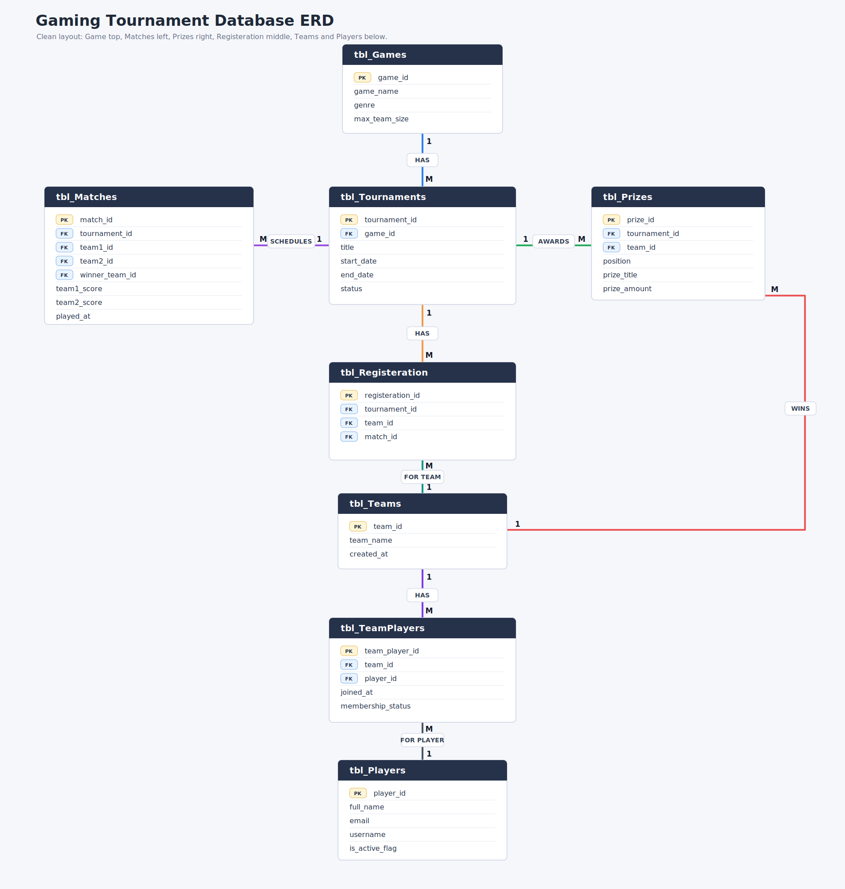

# Esports Tournament Management Database

A Microsoft SQL Server DBMS project for managing esports games, tournaments, players, teams, registrations, matches, and prize records.

The canonical final SQL source is preserved here:

[final-source-code/Final Source Code.sql](<final-source-code/Final Source Code.sql>)

The same work is also split into numbered files inside [sql/](sql/) so it is easier to review and run in SSMS. The question numbers are now continuous from `Q1` to `Q60` across the final source, split SQL files, question list, and GUI.



## Quick Links

- [Open the GUI](gui/index.html)
- [Run all SQL](run_all.sql)
- [Question list](questions.md)
- [Database design notes](docs/database_design.md)
- [Requirements coverage](docs/requirements_coverage.md)
- [SSMS run guide](docs/ssms_run_guide.md)
- [Project scenario](docs/project_scenario.md)

## Repository Structure

| Path | Purpose |
| --- | --- |
| [final-source-code/](final-source-code/) | Canonical final SQL source file. |
| [sql/](sql/) | Split SQL scripts arranged in execution order. |
| [gui/](gui/) | Static browser GUI for presenting the project. |
| [Enhanced-ERD/](Enhanced-ERD/) | Current diagram SVG and browser-openable HTML. |
| [docs/](docs/) | Supporting project documentation. |
| [questions.md](questions.md) | Clean DBMS question list matching `Q1` to `Q60`. |
| [run_all.sql](run_all.sql) | SQLCMD runner that executes all split SQL files. |

## Live GUI

The root [index.html](index.html) redirects to [gui/index.html](gui/index.html). For GitHub Pages, publish from the `main` branch and root folder.

The GUI files are:

- [gui/index.html](gui/index.html)
- [gui/style.css](gui/style.css)
- [gui/app.js](gui/app.js)

## Project Scenario

The database is designed for an esports tournament organizer that needs to manage games, tournaments, players, teams, team memberships, registrations, matches, and prize records.

The system supports:

- Game records such as Valorant, Football, Counter Strike, Apex Legends, COD, Delta Force, PUBG, and DOTA 2.
- Tournament records with statuses such as `Upcoming`, `Ongoing`, and `Finished`.
- Player records with email, username, and active/inactive status.
- Teams stored independently from tournaments.
- Player membership in teams through a bridge table.
- Registration rows connecting tournaments, teams, and matches.
- Match records with two teams, scores, winner, and match date/time.
- Prize records for Gold, Silver, and Bronze positions.

More detail is available in [Project Scenario](docs/project_scenario.md).

## Database Tables

| Table | Purpose |
| --- | --- |
| `tbl_Games` | Stores game information such as name, genre, and max team size. |
| `tbl_Tournaments` | Stores tournament events and links each tournament to one game. |
| `tbl_Teams` | Stores team details such as team name and creation date. |
| `tbl_Players` | Stores registered player details and active/inactive status. |
| `tbl_TeamPlayers` | Bridge table for the many-to-many relationship between players and teams. |
| `tbl_Matches` | Stores match details, competing teams, scores, winner, and play time. |
| `tbl_Registeration` | Connects tournament teams to the matches they play. |
| `tbl_Prizes` | Stores tournament prize positions, winning teams, titles, and amounts. |

The project also includes a temporary practice table, `tbl_testTable`, for DDL operations such as constraint changes, rename, column changes, `TRUNCATE`, and `DROP`.

## Diagram

- [Enhanced ERD SVG](Enhanced-ERD/visual-erd.svg)
- [Enhanced ERD HTML](Enhanced-ERD/visual-erd.html)
- [Database Design Notes](docs/database_design.md)

## SQL Features Covered

This project demonstrates:

- Database creation and table creation
- Primary keys and foreign keys
- `UNIQUE` and `CHECK` constraints
- `ALTER TABLE`, `TRUNCATE`, and `DROP`
- Insert, update, delete, and soft delete operations
- `SELECT`, `WHERE`, `IN`, `BETWEEN`, `AND`, `OR`
- `GROUP BY`, `HAVING`, and `ORDER BY`
- Subqueries using `IN`, `NOT IN`, `EXISTS`, `NOT EXISTS`, `ANY`, and `ALL`
- Aggregate functions such as `SUM`, `AVG`, `COUNT`, `MAX`, and `MIN`
- Text search using `LIKE`
- Join queries using `INNER JOIN`, `LEFT JOIN`, `RIGHT JOIN`, `FULL JOIN`, and `SELF JOIN`
- User-defined functions
- Stored procedures

### User-Defined Functions

- Scalar function to display total matches
- Scalar function to calculate total match score
- Table-valued function to show all active players
- Table-valued function to show tournaments by status

### Stored Procedures

- Non-parameterized procedure to show all active players
- Parameterized procedure to show tournaments by status
- Procedure with `IF ELSE` to check player status
- Procedure with `WHILE` loop to show prize-winning teams in a specific tournament

See [Requirements Coverage](docs/requirements_coverage.md) for the mapped checklist.

## How To Run In SSMS 2022

### Option 1: Run the full project

1. Open [run_all.sql](run_all.sql) in SQL Server Management Studio 2022.
2. At the top of `run_all.sql`, replace this line:

```sql
:setvar ProjectRoot "C:\Path\To\esports-tournament-dbms"
```

with the real path to this repository. Example:

```sql
:setvar ProjectRoot "C:\Users\YourName\Downloads\esports-tournament-dbms"
```

3. In SSMS, enable `Query` -> `SQLCMD Mode`.
4. Click `Execute`.

### Option 2: Run files manually

Open and run the files inside [sql/](sql/) in this order:

1. `00_database_setup.sql`
2. `01_schema_tables.sql`
3. `02_test_tables_and_ddl_changes.sql`
4. `03_seed_data.sql`
5. `04_preview_tables.sql`
6. `05_dml_updates_deletes.sql`
7. `06_drl_select_queries.sql`
8. `07_subqueries.sql`
9. `08_aggregates_text_search.sql`
10. `09_join_queries.sql`
11. `10_function_queries.sql`

## Notes

- The final source is [final-source-code/Final Source Code.sql](<final-source-code/Final Source Code.sql>).
- The split SQL files mirror the final source numbering and add SSMS-friendly `USE [DB]` and `GO` separators.
- `questions.md` and the GUI query explorer match the same `Q1` to `Q60` sequence.

## Author

Prepared by Haris as a DBMS project using Microsoft SQL Server and SSMS 2022.
