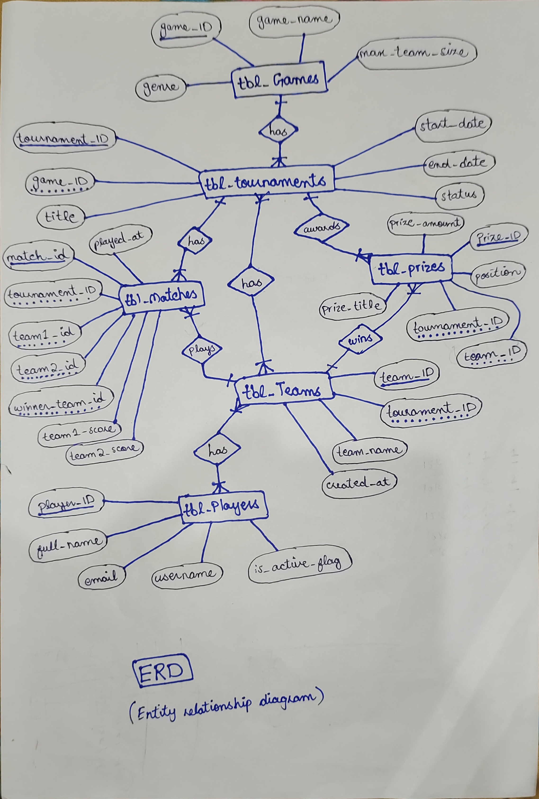

# Esports Tournament Management Database

A Microsoft SQL Server DBMS project for managing esports games, tournaments, players, teams, registrations, matches, and prize records.

## Main Files

| Path | Purpose |
| --- | --- |
| [final-source-code/Final Source Code.sql](<final-source-code/Final Source Code.sql>) | Complete final SQL source file. |
| [sql/](sql/) | Split SQL scripts arranged in execution order. |
| [gui/](gui/) | Static browser GUI for presenting the project. |
| [Enhanced-ERD/](Enhanced-ERD/) | ERD and EERD diagram images. |
| [questions.md](questions.md) | DBMS question list matching `Q1` to `Q61`. |
| [run_all.sql](run_all.sql) | SQLCMD runner for executing all split SQL files. |

## Diagrams

### ERD



### EERD


More database design detail is available in [docs/database_design.md](docs/database_design.md).

## Project Scenario

The database is designed for an esports tournament organizer. It manages games, tournaments, teams, players, team memberships, registrations, matches, and prizes.

The system supports:

- Games such as Valorant, Football, Counter Strike, Apex Legends, COD, Delta Force, PUBG, and DOTA 2.
- Tournaments with statuses such as `Upcoming`, `Ongoing`, and `Finished`.
- Players with email, username, and active/inactive status.
- Teams stored independently from tournaments.
- Team membership through `tbl_TeamPlayers`.
- Tournament registrations through `tbl_Registeration`.
- Match records with scores, winner team, and match date/time.
- Prize records for Gold, Silver, and Bronze positions.

## Database Tables

| Table | Purpose |
| --- | --- |
| `tbl_Games` | Stores game information such as name, genre, and max team size. |
| `tbl_Tournaments` | Stores tournament events and links each tournament to one game. |
| `tbl_Teams` | Stores team details such as team name and creation date. |
| `tbl_Players` | Stores registered player details and active/inactive status. |
| `tbl_TeamPlayers` | Handles the many-to-many relationship between players and teams. |
| `tbl_Matches` | Stores match details, competing teams, scores, winner, and play time. |
| `tbl_Registeration` | Connects tournament teams to the matches they play. |
| `tbl_Prizes` | Stores tournament prize positions, winning teams, titles, and amounts. |

## CRUD And SQL Coverage

This project covers the main CRUD operations:

| Operation | Covered Through |
| --- | --- |
| Create | Database creation, table creation, constraints, and seed inserts. |
| Read | Select queries, filters, joins, subqueries, functions, and stored procedures. |
| Update | Update queries for player, team, tournament, and match-related records. |
| Delete | Delete, soft delete, truncate, and drop practice operations. |

It also demonstrates:

- Primary keys and foreign keys
- `UNIQUE` and `CHECK` constraints
- `ALTER TABLE`
- `SELECT`, `WHERE`, `IN`, `BETWEEN`, `AND`, and `OR`
- `GROUP BY`, `HAVING`, and `ORDER BY`
- Subqueries using `IN`, `NOT IN`, `EXISTS`, `NOT EXISTS`, `ANY`, and `ALL`
- Aggregate functions such as `SUM`, `AVG`, `COUNT`, `MAX`, and `MIN`
- Text search using `LIKE`
- Joins using `INNER JOIN`, `LEFT JOIN`, `RIGHT JOIN`, `FULL JOIN`, and `SELF JOIN`
- User-defined functions
- Stored procedures

## How To Run In SSMS 2022

### Option 1: Run the full project

1. Open [run_all.sql](run_all.sql) in SQL Server Management Studio 2022.
2. Replace the project root path at the top of the file:

```sql
:setvar ProjectRoot "C:\Path\To\esports-tournament-dbms"
```

Example:

```sql
:setvar ProjectRoot "C:\Users\YourName\Downloads\esports-tournament-dbms"
```

3. Enable `Query` -> `SQLCMD Mode`.
4. Click `Execute`.

### Option 2: Run files manually

Run the files inside [sql/](sql/) in this order:

1. `00_database_setup.sql`
2. `01_schema_tables.sql`
3. `02_test_tables_and_ddl_changes.sql`
4. `03_seed_data.sql`
5. `04_preview_tables.sql`
6. `05_dml_updates_deletes.sql`
7. `06_drl_select_queries.sql`
8. `07_subqueries.sql`
9. `08_aggregates_text_search.sql`
10. `09_join_queries.sql`
11. `10_function_queries.sql`

## GUI

Open [gui/index.html](gui/index.html) in a browser to view the static project interface. The root [index.html](index.html) redirects to the GUI.

## Supporting Docs

- [Project scenario](docs/project_scenario.md)
- [Database design notes](docs/database_design.md)
- [Requirements coverage](docs/requirements_coverage.md)
- [SSMS run guide](docs/ssms_run_guide.md)

## Author

Prepared by Haris as a DBMS project using Microsoft SQL Server and SSMS 2022.
