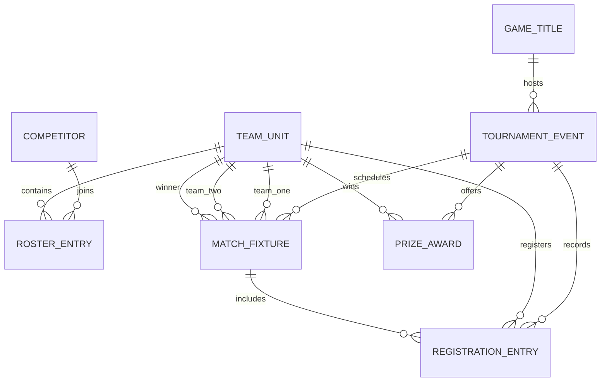

# Database Design, ERD, and EERD

## Diagram

Available diagram files:

- [ERD JPEG](../Enhanced-ERD/ERD.jpeg)
- [EERD JPEG](../Enhanced-ERD/EERD.jpeg)

## Main Database Tables

| Table | Description |
| --- | --- |
| `tbl_Games` | Stores available games, their genres, and maximum team size. |
| `tbl_Tournaments` | Stores tournaments and links each tournament to one game. |
| `tbl_Teams` | Stores team details independently from tournaments. |
| `tbl_Players` | Stores player information and active/inactive status. |
| `tbl_TeamPlayers` | Resolves the many-to-many relationship between players and teams. |
| `tbl_Matches` | Stores match records, scores, winners, and match time. |
| `tbl_Registeration` | Connects tournaments, teams, and matches. |
| `tbl_Prizes` | Stores prize details, winning team, position, title, and amount. |

## Relationship Summary

- `tbl_Games` to `tbl_Tournaments`: one-to-many.
- `tbl_Tournaments` to `tbl_Matches`: one-to-many.
- `tbl_Tournaments` to `tbl_Registeration`: one-to-many.
- `tbl_Tournaments` to `tbl_Prizes`: one-to-many.
- `tbl_Players` to `tbl_Teams`: many-to-many through `tbl_TeamPlayers`.
- `tbl_Teams` to `tbl_Matches`: a team can appear as `team1_id`, `team2_id`, or `winner_team_id`.
- `tbl_Registeration` to `tbl_Teams` and `tbl_Matches`: registration rows show which team is connected to which match.
- `tbl_Prizes` to `tbl_Teams`: prize rows store the winning team for each prize position.

## Mermaid ERD

## EERD Explanation

The enhanced design adds relationship meaning and constraint detail beyond the basic table list.

## Associative Entity

The relationship between players and teams is many-to-many. In the relational database, this is handled using `tbl_TeamPlayers`.

This table stores:

- `team_player_id`
- `team_id`
- `player_id`
- `membership_status`

## Registration Entity

`tbl_Registeration` connects:

- `tournament_id`
- `team_id`
- `match_id`

This makes it clear which team is registered in which tournament match.

## Domain Constraints

The design includes controlled values and rules, such as:

- Tournament status values like `Upcoming`, `Ongoing`, and `Finished`.
- Player active status through `is_active_flag`.
- Team membership status through `membership_status`.
- Prize position limited to `1`, `2`, and `3` by a `CHECK` constraint.

## Optional Relationship

`winner_team_id` in `tbl_Matches` is nullable. This means a match can exist before a winner is assigned.
